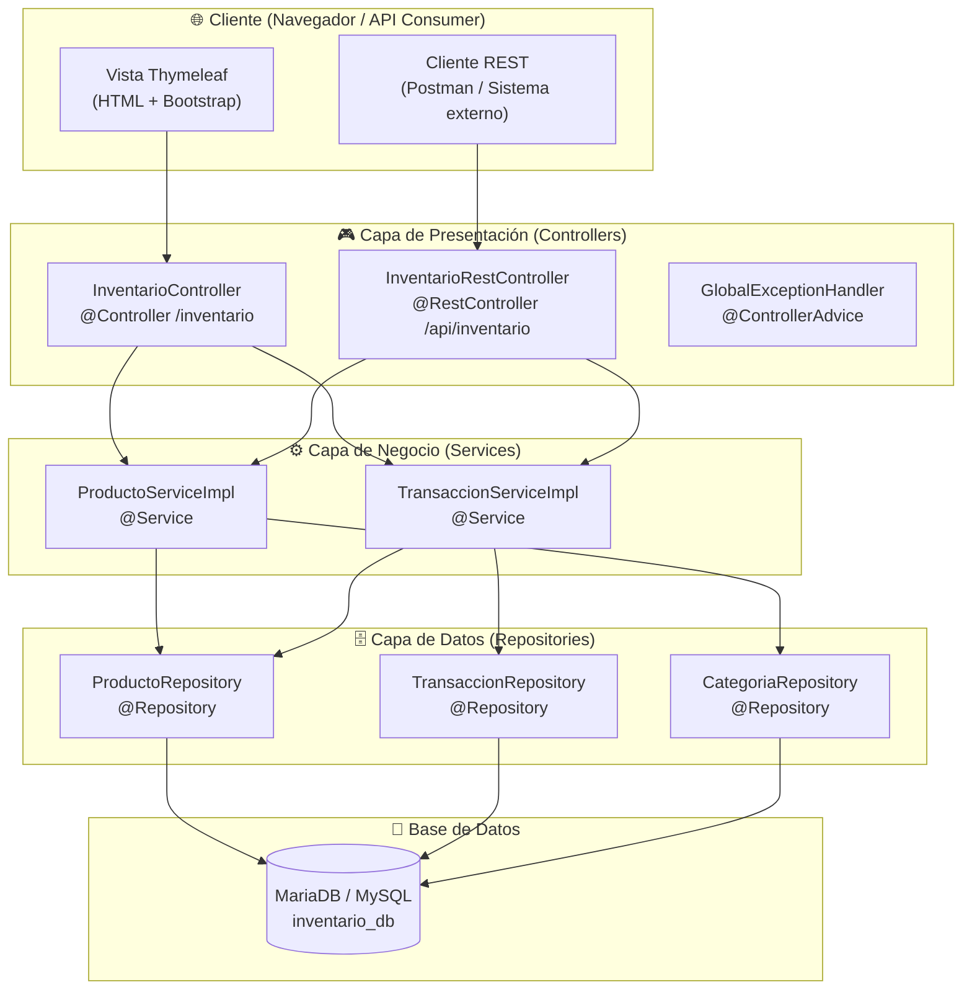

# Manual Técnico — Sistema de Inventario Transaccional

**Proyecto:** Sistema de Inventario Transaccional  
**Versión:** 1.0.0  
**Stack:** Java 17 + Spring Boot 3.3 + Thymeleaf + JPA/Hibernate + MariaDB  
**CI/CD:** Jenkins + SonarQube + JaCoCo + Checkmarx

---

## Tabla de Contenidos

1. [Planteamiento del Problema](planteamiento.md)
2. [Requerimientos Funcionales y No Funcionales](requerimientos.md)
3. [Casos de Uso](casos-de-uso.md)
4. [Diagrama de BD y Diccionario de Datos](diagrama-bd.md)
5. [Plan de Trabajo](plan-trabajo.md)
6. [Manual de Usuario](manual-usuario.md)

---

## Arquitectura del Sistema

### Diagrama de Arquitectura en Capas



---

## Estructura del Proyecto

```
sistema-inventario/
├── Jenkinsfile                          # Pipeline CI/CD declarativo (5 stages)
├── pom.xml                              # Dependencias Maven + JaCoCo
├── docs/                                # 📚 Documentación del proyecto
│   ├── README.md                        # Este archivo (índice)
│   ├── planteamiento.md                 # Planteamiento del problema
│   ├── requerimientos.md                # RF y RNF
│   ├── casos-de-uso.md                  # Diagramas y descripciones
│   ├── diagrama-bd.md                   # ER + Diccionario de datos
│   ├── plan-trabajo.md                  # Cronograma de actividades
│   └── manual-usuario.md                # Guía de uso del sistema
└── src/
    ├── main/
    │   ├── java/com/universidad/inventario/
    │   │   ├── SistemaInventarioApplication.java   # Main class
    │   │   ├── DataInitializer.java                # Datos de prueba iniciales
    │   │   ├── config/
    │   │   │   └── WebConfig.java                  # i18n, LocaleResolver
    │   │   ├── controller/
    │   │   │   ├── InventarioController.java        # MVC (vistas Thymeleaf)
    │   │   │   ├── InventarioRestController.java    # REST API (/api/inventario)
    │   │   │   └── GlobalExceptionHandler.java      # Manejo global de errores
    │   │   ├── dto/
    │   │   │   ├── ProductoDTO.java
    │   │   │   ├── TransaccionDTO.java
    │   │   │   └── CategoriaDTO.java
    │   │   ├── entity/
    │   │   │   ├── Producto.java                   # @Entity JPA
    │   │   │   ├── Categoria.java                  # @Entity JPA
    │   │   │   └── Transaccion.java                # @Entity JPA + @PrePersist
    │   │   ├── exception/
    │   │   │   ├── RecursoNoEncontradoException.java
    │   │   │   └── StockInsuficienteException.java
    │   │   ├── repository/
    │   │   │   ├── ProductoRepository.java          # JpaRepository + @Query
    │   │   │   ├── CategoriaRepository.java
    │   │   │   └── TransaccionRepository.java
    │   │   └── service/
    │   │       ├── ProductoService.java             # Interface
    │   │       ├── TransaccionService.java          # Interface
    │   │       └── impl/
    │   │           ├── ProductoServiceImpl.java     # Lógica de negocio
    │   │           └── TransaccionServiceImpl.java  # Reglas de stock
    │   └── resources/
    │       ├── application.properties               # Configuración principal
    │       ├── application-dev.properties           # Perfil desarrollo
    │       ├── i18n/
    │       │   ├── messages.properties              # Mensajes por defecto (es)
    │       │   ├── messages_es.properties           # Español
    │       │   └── messages_en.properties           # Inglés
    │       └── templates/
    │           ├── layout/
    │           │   └── base.html                   # Layout base Thymeleaf
    │           └── inventario/
    │               ├── lista.html                  # Lista de productos
    │               ├── producto-form.html           # Formulario producto
    │               ├── transaccion-form.html        # Formulario transacción
    │               └── transacciones-lista.html     # Lista transacciones
    └── test/
        └── java/com/universidad/inventario/
            └── service/impl/
                ├── ProductoServiceImplTest.java     # 9 casos (1 @Disabled CI)
                └── TransaccionServiceImplTest.java  # 5 casos
```

---

## Configuración del Entorno de Desarrollo

### Pre-requisitos

- **JDK 17** (OpenJDK o Amazon Corretto)
- **Maven 3.8+**
- **MariaDB 10.x** o **MySQL 8.x**
- **Git**
- **Jenkins** (para CI/CD, opcional en desarrollo)

### Pasos de instalación

```bash
# 1. Clonar el repositorio
git clone https://github.com/[usuario]/sistema-inventario.git
cd sistema-inventario

# 2. Crear la base de datos (si no existe)
mysql -u root -p -e "CREATE DATABASE IF NOT EXISTS inventario_db CHARACTER SET utf8mb4;"

# 3. Configurar credenciales en application.properties
# spring.datasource.username=root
# spring.datasource.password=TU_PASSWORD

# 4. Ejecutar la aplicación
mvn spring-boot:run

# 5. Abrir en navegador
# http://localhost:8080/inventario
```

### Comandos útiles

```bash
# Compilar y ejecutar pruebas
mvn clean test

# Generar reporte de cobertura JaCoCo
mvn clean verify
# Reporte en: target/site/jacoco/index.html

# Empaquetar JAR ejecutable
mvn package -DskipTests

# Ejecutar JAR directamente
java -jar target/sistema-inventario-1.0.0.jar
```

---

## Endpoints de la API REST

| Método | URL | Descripción | Respuesta |
|---|---|---|---|
| GET | `/api/inventario/productos` | Listar todos los productos | `200 OK` — Lista JSON |
| GET | `/api/inventario/productos/{id}` | Obtener producto por ID | `200 OK` / `404 Not Found` |
| POST | `/api/inventario/transacciones` | Registrar transacción | `201 Created` / `400 Bad Request` |
| GET | `/api/inventario/transacciones` | Listar todas las transacciones | `200 OK` — Lista JSON |

### Ejemplo: Crear una transacción via REST

```json
POST /api/inventario/transacciones
Content-Type: application/json

{
  "idProducto": 1,
  "tipoMovimiento": "ENTRADA",
  "cantidad": 20
}
```

Respuesta exitosa (`201 Created`):
```json
{
  "idTransaccion": 15,
  "idProducto": 1,
  "nombreProducto": "Laptop Dell Inspiron 15",
  "tipoMovimiento": "ENTRADA",
  "cantidad": 20,
  "fechaMovimiento": "2026-06-23T17:30:00"
}
```

---

## Pipeline CI/CD — Jenkins

El pipeline está definido en `Jenkinsfile` con 5 stages:

| Stage | Descripción |
|---|---|
| 1. Checkout | Clona el código desde el repositorio Git |
| 2. Build & Test | Compila con Maven y ejecuta las pruebas unitarias (JUnit 5 + Mockito) |
| 3. Security & Quality Scan | Analiza calidad (SonarQube) y vulnerabilidades (Checkmarx) |
| 4. Package | Empaqueta el JAR ejecutable (`mvn package -DskipTests`) |
| 5. Deploy Local | Detiene instancia previa y lanza el JAR en `localhost:8080` |

### Configuración requerida en Jenkins

1. **Global Tool Configuration:**
   - Maven: nombre `Maven 3`
   - JDK: nombre `Java 17`

2. **Plugins requeridos:**
   - SonarQube Scanner for Jenkins
   - JUnit Plugin
   - Credentials Plugin

3. **Credenciales:**
   - `sonar-token-local`: Token generado en SonarQube > My Account > Security

4. **Variables de entorno a ajustar en Jenkinsfile:**
   - `SONAR_HOST_URL`: URL de SonarQube (por defecto `http://localhost:9000`)
   - `CHECKMARX_CLI`: Ruta al CLI de Checkmarx local
