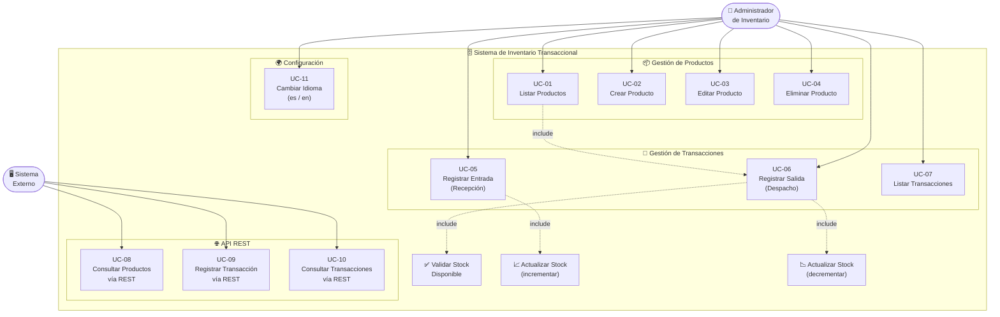

# Diagrama de Casos de Uso — Sistema de Inventario Transaccional

**Proyecto:** Sistema de Inventario Transaccional  
**Versión:** 1.0.0

---

## 1. Actores del Sistema

| Actor | Tipo | Descripción |
|---|---|---|
| **Administrador de Inventario** | Primario | Usuario humano que interactúa con la interfaz web para gestionar productos y transacciones. |
| **Sistema Externo** | Secundario | Aplicación de terceros (e-commerce, ERP, etc.) que consume la API REST para consultar o registrar movimientos. |
| **Base de Datos (MariaDB)** | Secundario | Sistema de persistencia que almacena toda la información del inventario. |

---

## 2. Diagrama de Casos de Uso (Mermaid)

---

## 3. Descripción Detallada de Casos de Uso

---

### UC-01 — Listar Productos

| Campo | Descripción |
|---|---|
| **ID** | UC-01 |
| **Nombre** | Listar Productos |
| **Actor** | Administrador de Inventario |
| **Precondición** | La aplicación está en ejecución y la BD conectada. |
| **Flujo Principal** | 1. El usuario accede a `/inventario`. 2. El sistema consulta todos los productos (con categoría). 3. El sistema muestra la tabla con: ID, SKU, Nombre, Categoría, Precio, Stock. 4. Los productos con stock ≤5 muestran badge "LOW" en rojo. |
| **Flujo Alternativo** | Si no hay productos, se muestra el mensaje "No hay productos registrados." |
| **Postcondición** | Se muestra la lista actualizada de productos. |

---

### UC-02 — Crear Producto

| Campo | Descripción |
|---|---|
| **ID** | UC-02 |
| **Nombre** | Crear Producto |
| **Actor** | Administrador de Inventario |
| **Precondición** | Existen al menos una categoría en el sistema. |
| **Flujo Principal** | 1. El usuario hace clic en "Nuevo Producto". 2. El sistema muestra el formulario vacío con el select de categorías. 3. El usuario llena: nombre, SKU, categoría, precio y stock. 4. El usuario hace clic en "Guardar". 5. El sistema valida los datos. 6. El sistema guarda el producto. 7. El sistema redirige a la lista con mensaje de éxito. |
| **Flujo Alternativo A** | Si el SKU ya existe → mostrar error "Ya existe un producto con el SKU". |
| **Flujo Alternativo B** | Si hay campos inválidos (vacíos, negativos) → mostrar mensajes de validación en el formulario. |
| **Postcondición** | El nuevo producto queda guardado en la base de datos. |

---

### UC-03 — Editar Producto

| Campo | Descripción |
|---|---|
| **ID** | UC-03 |
| **Nombre** | Editar Producto |
| **Actor** | Administrador de Inventario |
| **Precondición** | El producto a editar existe en el sistema. |
| **Flujo Principal** | 1. El usuario hace clic en el botón ✏️ del producto. 2. El sistema carga el formulario pre-llenado con los datos actuales. 3. El usuario modifica los campos deseados. 4. El usuario hace clic en "Guardar". 5. El sistema valida y actualiza el producto. 6. Redirige con mensaje de éxito. |
| **Flujo Alternativo** | Si el nuevo SKU ya pertenece a otro producto → error de validación. |
| **Postcondición** | El producto queda actualizado en la base de datos. |

---

### UC-04 — Eliminar Producto

| Campo | Descripción |
|---|---|
| **ID** | UC-04 |
| **Nombre** | Eliminar Producto |
| **Actor** | Administrador de Inventario |
| **Precondición** | El producto a eliminar existe. |
| **Flujo Principal** | 1. El usuario hace clic en el botón 🗑️ del producto. 2. Aparece un diálogo de confirmación. 3. El usuario confirma. 4. El sistema elimina el producto y sus transacciones asociadas (cascade). 5. Redirige con mensaje de éxito. |
| **Flujo Alternativo** | El usuario cancela el diálogo → no se realiza ninguna acción. |
| **Postcondición** | El producto es eliminado de la base de datos. |

---

### UC-05 — Registrar Entrada (Recepción de Mercancía)

| Campo | Descripción |
|---|---|
| **ID** | UC-05 |
| **Nombre** | Registrar Entrada |
| **Actor** | Administrador de Inventario |
| **Precondición** | El producto destino existe en el sistema. |
| **Flujo Principal** | 1. El usuario accede a "Nueva Transacción". 2. Selecciona el producto. 3. Selecciona tipo: ENTRADA. 4. Ingresa la cantidad recibida. 5. El sistema suma la cantidad al stock actual. 6. Crea la transacción con fecha/hora automática. 7. Redirige con mensaje de éxito. |
| **Postcondición** | El stock del producto se incrementa; se crea registro de transacción. |

---

### UC-06 — Registrar Salida (Despacho de Mercancía)

| Campo | Descripción |
|---|---|
| **ID** | UC-06 |
| **Nombre** | Registrar Salida |
| **Actor** | Administrador de Inventario |
| **Precondición** | El producto existe y su stock es mayor a 0. |
| **Flujo Principal** | 1. El usuario selecciona el producto y tipo SALIDA. 2. Ingresa la cantidad a despachar. 3. El sistema verifica: `stock_actual >= cantidad`. 4. Si cumple: descuenta el stock y guarda la transacción. 5. Redirige con mensaje de éxito. |
| **Flujo Alternativo** | Si `stock_actual < cantidad` → lanza `StockInsuficienteException`. Se muestra error "Stock insuficiente para SKU-XXX: disponible=N, solicitado=M". |
| **Postcondición** | El stock se reduce; se crea registro de transacción. |

---

### UC-07 — Listar Transacciones

| Campo | Descripción |
|---|---|
| **ID** | UC-07 |
| **Nombre** | Listar Transacciones |
| **Actor** | Administrador de Inventario |
| **Flujo Principal** | 1. El usuario navega a "Transacciones". 2. El sistema lista todas las transacciones con: ID, Producto, Tipo, Cantidad, Fecha. |
| **Postcondición** | Se muestra el historial completo de movimientos. |

---

### UC-08/09/10 — API REST

| UC | Endpoint | Método | Respuesta |
|---|---|---|---|
| UC-08 | `/api/inventario/productos` | GET | Lista JSON de productos (200 OK) |
| UC-08b | `/api/inventario/productos/{id}` | GET | Producto JSON (200) / 404 si no existe |
| UC-09 | `/api/inventario/transacciones` | POST | Transacción creada (201) / 400 si inválida / 409 si stock insuficiente |
| UC-10 | `/api/inventario/transacciones` | GET | Lista JSON de transacciones (200 OK) |

---

### UC-11 — Cambiar Idioma

| Campo | Descripción |
|---|---|
| **ID** | UC-11 |
| **Nombre** | Cambiar Idioma de la Interfaz |
| **Actor** | Administrador de Inventario |
| **Flujo Principal** | 1. El usuario hace clic en "ES" o "EN" en la barra de navegación. 2. El sistema agrega el parámetro `?lang=es` o `?lang=en` a la URL. 3. El `LocaleChangeInterceptor` detecta el cambio. 4. La sesión guarda el nuevo locale. 5. Toda la interfaz se muestra en el idioma seleccionado. |
| **Postcondición** | La interfaz queda en el idioma elegido durante toda la sesión. |
