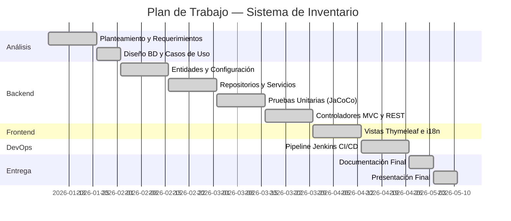

# Plan de Trabajo — Sistema de Inventario Transaccional

**Unidad de Aprendizaje:** Diseño de Sistemas  
**Proyecto:** Sistema de Inventario Transaccional  
**Versión del Sistema:** 1.0.0  
**Duración total estimada:** 16 semanas (semestre)

---

## 1. Metodología

El proyecto sigue una metodología **iterativa e incremental**, dividida en sprints de 2 semanas. Cada sprint entrega un componente funcional que se revisa en clase.

---

## 2. Cronograma de Actividades

### Semana 1-2 — Análisis y Diseño

| Actividad | Responsable | Entregable |
|---|---|---|
| Definición del problema y alcance | Equipo | `docs/planteamiento.md` |
| Levantamiento de requerimientos (RF y RNF) | Equipo | `docs/requerimientos.md` |
| Diseño del modelo Entidad-Relación | Equipo | `docs/diagrama-bd.md` |
| Elaboración de Casos de Uso | Equipo | `docs/casos-de-uso.md` |
| Creación del repositorio Git (GitHub/Bitbucket) | Líder técnico | Repo remoto configurado |

**Hito:** ✅ Documentación de análisis completa y revisada por el docente.

---

### Semana 3-4 — Configuración del Proyecto y Modelo de Datos

| Actividad | Responsable | Entregable |
|---|---|---|
| Creación del proyecto Spring Boot con Maven | Desarrollador | `pom.xml` configurado |
| Configuración de dependencias (JPA, Thymeleaf, Validation, Lombok) | Desarrollador | Dependencias en pom.xml |
| Implementación de entidades JPA: `Categoria`, `Producto`, `Transaccion` | Desarrollador | Clases `entity/*.java` |
| Configuración de `application.properties` (DB, JPA, i18n) | Desarrollador | `application.properties` |
| Configuración del perfil de desarrollo (`application-dev.properties`) | Desarrollador | `application-dev.properties` |
| Primera revisión del proyecto con el docente | Equipo | — |

**Hito:** ✅ Proyecto compila y Hibernate crea las tablas automáticamente.

---

### Semana 5-6 — Capa de Repositorios y Servicios

| Actividad | Responsable | Entregable |
|---|---|---|
| Implementación de repositorios JPA: `ProductoRepository`, `CategoriaRepository`, `TransaccionRepository` | Desarrollador | Clases `repository/*.java` |
| Creación de DTOs: `ProductoDTO`, `TransaccionDTO`, `CategoriaDTO` | Desarrollador | Clases `dto/*.java` |
| Implementación de servicios: `ProductoServiceImpl`, `TransaccionServiceImpl` | Desarrollador | Clases `service/impl/*.java` |
| Implementación de regla de negocio: validación de stock en SALIDA | Desarrollador | Lógica en `TransaccionServiceImpl` |
| Implementación de excepciones personalizadas | Desarrollador | `RecursoNoEncontradoException`, `StockInsuficienteException` |

**Hito:** ✅ Capa de servicio funcional con lógica de negocio validada manualmente.

---

### Semana 7-8 — Pruebas Unitarias

| Actividad | Responsable | Entregable |
|---|---|---|
| Configuración de JUnit 5 + Mockito | Desarrollador | Dependencia en `pom.xml` |
| Configuración de JaCoCo para cobertura | Desarrollador | Plugin en `pom.xml` |
| Escritura de pruebas unitarias para `ProductoServiceImpl` | Desarrollador | `ProductoServiceImplTest.java` (≥8 casos) |
| Escritura de pruebas unitarias para `TransaccionServiceImpl` | Desarrollador | `TransaccionServiceImplTest.java` (≥5 casos) |
| Verificación de cobertura ≥80% con `mvn verify` | Desarrollador | Reporte JaCoCo en `target/site/jacoco/` |
| Segunda revisión del proyecto con el docente | Equipo | — |

**Hito:** ✅ Todos los tests pasan. Cobertura de líneas ≥80%.

---

### Semana 9-10 — Controladores MVC y API REST

| Actividad | Responsable | Entregable |
|---|---|---|
| Implementación de `InventarioController` (rutas MVC/Thymeleaf) | Desarrollador | `InventarioController.java` |
| Implementación de `InventarioRestController` (API JSON) | Desarrollador | `InventarioRestController.java` |
| Implementación de `GlobalExceptionHandler` | Desarrollador | `GlobalExceptionHandler.java` |
| Configuración de `WebConfig` (i18n, LocaleResolver) | Desarrollador | `WebConfig.java` |
| Pruebas manuales de los endpoints REST con Postman/curl | Desarrollador | — |

**Hito:** ✅ CRUD completo funcional vía MVC. API REST responde correctamente.

---

### Semana 11-12 — Capa de Vista (Thymeleaf + i18n)

| Actividad | Responsable | Entregable |
|---|---|---|
| Diseño e implementación del layout base (`base.html`) | Front-end | `templates/layout/base.html` |
| Implementación de vista lista de productos (`lista.html`) | Front-end | `templates/inventario/lista.html` |
| Implementación de formulario de producto (`producto-form.html`) | Front-end | `templates/inventario/producto-form.html` |
| Implementación de formulario de transacción (`transaccion-form.html`) | Front-end | `templates/inventario/transaccion-form.html` |
| Implementación de lista de transacciones (`transacciones-lista.html`) | Front-end | `templates/inventario/transacciones-lista.html` |
| Creación de archivos de mensajes i18n (es / en) | Front-end | `i18n/messages_es.properties`, `messages_en.properties` |
| Tercera revisión del proyecto con el docente | Equipo | — |

**Hito:** ✅ Interfaz web funcional en español e inglés.

---

### Semana 13-14 — Pipeline CI/CD con Jenkins

| Actividad | Responsable | Entregable |
|---|---|---|
| Instalación y configuración de Jenkins local | DevOps | Jenkins en `localhost:8080` |
| Configuración del servidor SonarQube local | DevOps | SonarQube en `localhost:9000` |
| Creación del `Jenkinsfile` con pipeline declarativo (5 stages) | DevOps | `Jenkinsfile` |
| Configuración de credenciales en Jenkins (`sonar-token-local`) | DevOps | Credencial configurada en Jenkins |
| Integración de SonarQube con el Quality Gate | DevOps | Quality Gate configurado |
| Integración de Checkmarx (si disponible) | DevOps | Reporte de seguridad |
| Primera ejecución exitosa del pipeline completo | Equipo | Build verde en Jenkins |

**Hito:** ✅ Pipeline CI/CD ejecuta exitosamente los 5 stages (Checkout → Build → Scan → Package → Deploy).

---

### Semana 15 — Documentación Final

| Actividad | Responsable | Entregable |
|---|---|---|
| Redacción del Manual de Usuario | Equipo | `docs/manual-usuario.md` |
| Revisión y actualización del Manual Técnico | Equipo | `docs/planteamiento.md`, `docs/requerimientos.md`, `docs/casos-de-uso.md`, `docs/diagrama-bd.md` |
| Limpieza del código (comentarios, formato) | Desarrollador | Código revisado |
| Push final al repositorio remoto (tag `v1.0.0`) | Líder técnico | Tag en Git |

**Hito:** ✅ Todos los documentos entregados. Código taggeado en Git.

---

### Semana 16 — Presentación Final

| Actividad | Responsable |
|---|---|
| Preparación de presentación (demo en vivo) | Equipo |
| Demostración del sistema funcionando en clase | Equipo |
| Demostración del pipeline Jenkins ejecutándose | Equipo |
| Entrega de documentación final al docente | Líder |

**Hito:** ✅ Presentación final aprobada.

---

## 3. Resumen de Hitos

---

## 4. Criterios de Éxito

| Criterio | Métrica | Estado |
|---|---|---|
| Arquitectura MVC implementada | Separación en capas Controller/Service/Repository/Entity | ✅ |
| Patrones de diseño aplicados | DTO, Service, Repository, Dependency Injection | ✅ |
| CRUD completo de productos | Crear, Leer, Actualizar, Eliminar funcionando | ✅ |
| Reglas de negocio validadas | Stock no negativo, SKU único | ✅ |
| API REST funcional | 4 endpoints respondiendo con HTTP correcto | ✅ |
| Internacionalización | Español e Inglés funcionando | ✅ |
| Pruebas unitarias ≥80% cobertura | Reporte JaCoCo muestra ≥80% líneas | ✅ |
| Pipeline CI/CD funcional | 5 stages en Jenkins ejecutan sin errores | ✅ |
| Documentación completa | Todos los entregables creados | ✅ |
